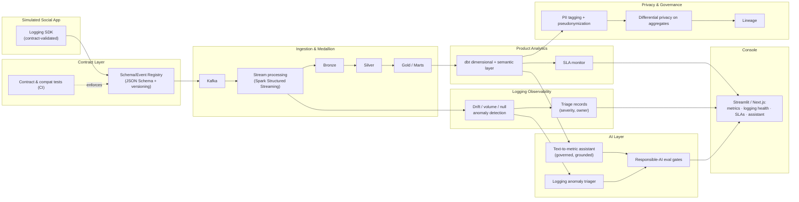

# PulseGate

**Product Analytics & Logging Integrity Platform**

> A product-analytics data platform for a simulated social app, built around a
> principle most analytics stacks skip: **data quality is enforced at the source,
> not patched downstream.** Event contracts gate ingestion, logging regressions
> are caught before they corrupt metrics, and an AI assistant surfaces product
> insight behind responsible-AI eval gates.

Built as a portfolio artifact for a **Data Engineer, Product Analytics** role. The
design mirrors the shape of a Meta-family product-analytics problem — billions of
events, multiple surfaces, strict privacy requirements — at a runnable local scale.

---

## Why this project looks different

Most analytics pipelines treat logging quality as an afterthought: events land,
something breaks upstream, and analysts discover it weeks later when a retention
number looks wrong. PulseGate inverts that. It comes from a **test-and-quality
engineering background applied to data logging** — the parts of a product-analytics
role that usually get the least love:

- **Event contracts** are versioned, tested, and enforced at the producer *and* at
  ingestion, so malformed or drifted events are rejected or quarantined rather than
  silently polluting gold tables.
- **Logging observability** detects volume drops, null spikes, schema drift, and
  orphaned/duplicate events, then writes structured **triage records** with severity
  and a suggested owner.
- Only *then* does the platform compute the product metrics everyone actually wants.

That ordering — quality gate first, metrics second — is the thesis.

---

## Architecture



---

## Tech stack

| Layer | Tools |
|---|---|
| Event contracts | JSON Schema, custom producer SDK, `pytest` compat/contract tests |
| Streaming ingest | Kafka, Spark Structured Streaming |
| Storage / medallion | DuckDB (local) · Iceberg + Snowflake (cloud profile) |
| Transformation / semantic layer | dbt (dimensional + metrics models) |
| Data quality | Great Expectations + custom drift/anomaly checks |
| Privacy / governance | HMAC pseudonymization, PII tag registry, differential privacy on published aggregates |
| AI layer | Claude API, agent orchestration, MLflow (eval tracking) |
| Console | Streamlit (default) / Next.js (optional) |
| Orchestration | Airflow (or Prefect) |

---

## Repository structure

```
pulsegate/
├── contracts/                # event schemas + versioned registry
│   ├── registry/
│   └── tests/                # contract + backward-compat tests
├── generator/                # simulated social-app event producer
├── ingest/                   # Kafka producers/consumers, stream jobs
├── warehouse/
│   ├── bronze/ silver/ gold/
│   └── dbt/                  # dimensional models + semantic layer
├── quality/
│   ├── expectations/         # Great Expectations suites
│   ├── observability/        # drift/volume/null anomaly detection
│   └── triage/               # triage-record writer
├── sla/                      # SLA definitions + monitor
├── governance/              # PII tagging, pseudonymization, DP, lineage
├── ai/
│   ├── text_to_metric/       # governed NL → semantic-layer query
│   ├── anomaly_triager/      # RCA agent over logging anomalies
│   └── evals/                # responsible-AI eval gates + rubrics
├── app/                      # Streamlit / Next.js console
├── tests/                    # pytest suite
└── README.md
```

---

## Data model

A star schema over a simulated multi-surface social app (feed, stories/reels-equivalent,
messaging, ads):

- **`fact_events`** — one row per logged product event (session start, post, like,
  follow, message send, ad impression, ad click).
- **`dim_user`** — pseudonymized user, acquisition cohort, tenure bucket.
- **`dim_content`** — content/creative, type, surface.
- **`dim_surface`** — product surface / app family member.
- **`dim_date`** — calendar + rolling-window helpers.

Semantic-layer models compute **DAU/WAU/MAU**, **N-day retention cohorts**, **funnel
conversion**, and **feature adoption** — each defined once and reused across
dashboards and the AI assistant so a metric means the same thing everywhere.

---

## Logging integrity framework

The differentiating layer.

**1. Contracts.** Every event type has a versioned JSON Schema in the registry.
The producer SDK validates before emit; CI runs contract tests and rejects
backward-incompatible changes.

**2. Observability.** On each batch/stream window, the platform checks for:

- volume anomalies (sudden drops/spikes vs. baseline),
- null-rate spikes on required fields,
- schema drift (unexpected/new fields, type changes),
- orphaned events (e.g. a `like` with no resolvable content),
- duplicate event IDs.

**3. Triage.** Each detected issue becomes a structured triage record:
`{severity, event_type, signal, first_seen, sample_ids, suggested_owner}` — surfaced
in the console and optionally drafted into a root-cause hypothesis by the AI triager.

---

## SLAs

Per-dataset service-level agreements, monitored with breach alerts:

| Dataset | Freshness | Completeness | Accuracy |
|---|---|---|---|
| `fact_events` (bronze) | ≤ 15 min | ≥ 99.5% expected volume | schema-valid ≥ 99.9% |
| `gold.daily_active_users` | ≤ 2 h after day close | 100% of surfaces | reconciles to fact within 0.1% |
| `gold.retention_cohorts` | ≤ 6 h | all cohorts present | — |

---

## Privacy & governance

- **PII tag registry** — every column carries a sensitivity tag; tags drive masking.
- **Pseudonymization** — user identifiers HMAC-hashed before silver.
- **Differential privacy** — calibrated noise on published segment aggregates.
- **Lineage** — event → bronze → silver → gold → metric, queryable for any field.
- **Access model** — role-based views; raw PII isolated from analytics roles.

---

## AI layer (with responsible-AI eval gates)

Two agents, both gated:

- **Text-to-metric assistant** — natural-language questions ("7-day retention for the
  reels-equivalent surface last month") compile to **governed queries against the
  semantic layer**, not free-form text-to-SQL. Answers are grounded in defined
  metrics and cite the models used.
- **Logging anomaly triager** — reads observability output and drafts a root-cause
  hypothesis + suggested fix for each triage record.

**Eval gates** run in CI and at request time: grounding/hallucination checks
(does the answer map to a real metric definition?), fairness review on any
segment-level output, and refusal behavior on out-of-scope or privacy-violating
asks. Eval runs are tracked in MLflow with versioned rubrics.

---

## Getting started

```bash
# prerequisites: Python 3.11+, Docker (Kafka), make
git clone <repo-url> && cd pulsegate
make setup            # venv + deps
make up               # Kafka + local warehouse
make generate         # stream simulated events
make build            # dbt models + quality suites
make app              # launch console
```

---

## Testing

```bash
make test             # full pytest suite
make test-contracts   # event contract + backward-compat tests
make test-dbt         # dbt tests (uniqueness, not-null, relationships)
make test-evals       # responsible-AI eval gates
```

Contract tests, dbt tests, Great Expectations suites, and AI eval gates all run in
CI; a broken logging contract or a failed eval blocks merge.

---

## Current status & honest gaps

_(Kept explicit, in the spirit of documenting what's real vs. simulated.)_

- Runs on **simulated events at local scale**; the cloud (Iceberg + Snowflake)
  profile is designed but demonstrated on sampled volumes, not production scale.
- Differential-privacy parameters are illustrative, not tuned to a formal privacy
  budget policy.
- The AI layer is scoped to the semantic layer; it does not generate arbitrary SQL
  by design.

---

## Appendix — how this maps to the role

| JD responsibility | Where it lives |
|---|---|
| Frameworks that improve logging efficacy; triage | Contract registry + observability + triage |
| Own data architecture; cost/benefit tradeoffs | Medallion design + tradeoff notes |
| Define & manage SLAs | `sla/` monitor |
| Security model / privacy / governance | `governance/` |
| Sophisticated data models + visualizations, multi-use-case | dbt semantic layer + console |
| ETL from structured + unstructured sources | Kafka + stream layer (incl. message text) |
| Represent insights; influence product teams | Text-to-metric assistant |
| AI-tool integration + responsible AI (preferred) | `ai/` + eval gates |
